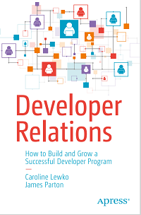

# Apress Source Code

This repository accompanies [*Developer Relations: How to Build and Grow a Successful Developer Program Apps*](https://www.apress.com/9781484271636) by Caroline Lewko, James Parton (Apress, 2021).

[comment]: #cover

Download the files as a zip using the green button, or clone the repository to your machine using Git.

## Releases

Release v1.0 corresponds to the code in the published book, without corrections or updates.

## Contributions

See the file Contributing.md for more information on how you can contribute to this repository.

## Further Book Information

* [Book Newsletter](https://devrelbook.substack.com/) to recieve to author updates.
* [Book Website](https://www.devrelbook.com/)
