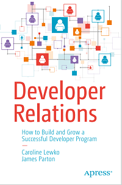

# Apress Source Code

This repository accompanies [*Developer Relations: How to Build and Grow a Successful Developer Program Apps*](https://www.apress.com/9781484271636) by Caroline Lewko, James Parton (Apress, 2021).

[comment]: #cover

Download the files as a zip using the green button, or clone the repository to your machine using Git.

## Releases

Release v1.0 corresponds to the code in the published book, without corrections or updates.

<<<<<<< main
## Developer Relations Program Directory

Have you ever been asked "How many DevRel Programs are there?"
So have we, and we never had a good answer, or a reference to point to.
We hope this Program Directory solves that for us all.

The idea is to crowdsource a list of all the DevRel programs out there, which will be beneficial for a number of reasons, including to:

* Describe the size of the DevRel community for the first time
* Provide examples and data to aid investment into your programs
* Forge new links between programs
* Aid career growth

[View, Add or Edit The Developer Relations Program Directory](https://www.devrelbook.com/devreldirectory)

## Related Articles
=======

* [A Framework for Developer Relations](https://devrelbook.substack.com/p/a-framework-for-developer-relations)
* [Developer First & Developer Plus Companies](https://devrelbook.substack.com/p/developer-first-and-developer-plus)
* [The Developer Journey Map](https://devrelbook.substack.com/p/the-developer-journey-map)
* [State of Developer Relations Report 2021](https://www.stateofdeveloperrelations.com/)
* [DevRel Directory](https://www.devrelbook.com/devreldirectory) - Data for more than 700 Developer Relations programs.

## Further Book Information

* [Book Newsletter](https://devrelbook.substack.com/) - Subscribe to recieve author updates.
* [Book Website](https://www.devrelbook.com/) - Find book ordering links, associated info, and more DevRel resources.
